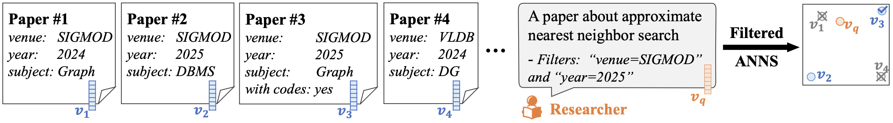

# Unified Navigating Graph Algorithm for Filtered Approximate Nearest Neighbor Search

This is the official implementation for paper [Navigating Labels and Vectors: A Unified Approach to Filtered Approximate Nearest Neighbor Search](https://doi.org/10.1145/3698822), which builds the Unified Navigating Graph (UNG) index for the task of Filtered Approximate Nearest Neighbor Search (Filtered-ANNS).

UNG is a general framework that supports various graph-based ANNS algorithms, which is currently implemented with the Vamana algorithm in [DiskANN](https://github.com/microsoft/DiskANN).


## Overview

Given a query vector $q$ with label set $f_q=\{a,b,...,z\}$, UNG finds top-K similar vectors $v$ (with label set $f_v$) from the base vector set, supporting four types of predicates:

- **Equality** ($f_q=f_v$): `SELECT top-K similar vectors WHERE label_1=a AND label_2=b AND ... AND label_n=z`
- **Containment** ($f_q \subseteq f_v$): `SELECT top-K similar vectors WHERE label_1=a AND label_2=b`
- **Overlap** ($f_q \cap f_v \neq \emptyset$): `SELECT top-K similar vectors WHERE label_1=a OR label_2=b`
- **No-filter** (traditional ANNS): `SELECT top-K similar vectors without any label constraints`



This repository also supports random generation of base and query label sets following five distributions:
- Zipf
- Multinomial  
- Uniform
- Poisson
- One random label per vector

## Building the Project

Environment Requirements

- CMake >= 3.15
- C++17 compiler
- Boost library
  - program_options component
  - filesystem component
- OpenMP support
- AVX2 instruction set support

Follow the steps below to build the project

```bash
mkdir build
cd build
# cmake -DCMAKE_BUILD_TYPE=Debug ../codes/ # Build with Debug mode
cmake -DCMAKE_BUILD_TYPE=Release ../codes/ # Build with Release mode
make -j
cd ..
```

## Data Preparation

Place your datasets in the `data directory, with each dataset in its own subdirectory. The directory structure should be:

```
data/
├── dataset1/
│   ├── base_vector_filename.bin
│   ├── base_label_filename.txt
│   ├── query_vector_filename.bin
│   └── query_label_filename.txt
├── dataset2/
│   ├── base_vector_filename.bin
│   ├── base_label_filename.txt
│   ├── query_vector_filename.bin
│   └── query_label_filename.txt
└── ...
```

### Vector Files

Vector data is stored in binary format:
- Binary file format
- First 4 bytes: total number of vectors N (`uint32_t`)
- Next 4 bytes: vector dimension D (`uint32_t`)
- Followed by N D-dimensional vectors, each vector using D*4 bytes

To convert from fvecs format (where each vector has a 4-byte dimension header), please use:

```bash
./build/tools/fvecs_to_bin \
    --data_type {float/int8/uint8} \
    --input_file {filename}.fvecs \
    --output_file {filename}.bin
```

<details>
<summary>Example commands for SIFT1M dataset</summary>

```bash
# Download data
cd ./data
wget ftp://ftp.irisa.fr/local/texmex/corpus/sift.tar.gz
tar -zxvf sift.tar.gz
cd ..

# Convert data
./build/tools/fvecs_to_bin --data_type float --input_file ./data/sift/sift_base.fvecs --output_file ./data/sift/sift_base.bin
./build/tools/fvecs_to_bin --data_type float --input_file ./data/sift/sift_query.fvecs --output_file ./data/sift/sift_query.bin
```
</details>

### Label Files

Label data is stored in `.txt` format:
- Labels are positive integers in range $[1,L]$, where $L$ is the total number of unique labels
- Each line $i$ contains the comma-separated label set for vector $i$ (one line per vector)
- No duplicate labels allowed in each vector's label set
- For optimal performance, smaller label IDs should have higher frequencies (label 1 should appear most frequently)

#### Base Label Files

Since unexpected label format may lead to runtime errors or inferior performance, please verify base label file format using:
```bash
python ./data/check_base_label.py {label_file}
```

If the dataset does not have a base label file, you can randomly generate one using:
```bash
./build/tools/generate_base_labels \
    --num_points {total_vectors} \
    --num_labels {total_labels} \
    --distribution_type {zipf/multi_normial/uniform/poisson/one_per_point} \
    --output_file {output_base_label_file}
```

<details>
<summary>Example commands for SIFT1M</summary>

```bash
./build/tools/generate_base_labels \
    --num_labels 12 --num_points 1000000 --distribution_type zipf \
    --output_file ./data/sift/sift_base_12_labels_zipf.txt
```
</details>

#### Query Label Files

Query label files follow the same format as base label files.

To generate random query label files:
```bash
./build/tools/generate_query_labels \
    --num_points {total_vectors} \
    --distribution_type {zipf/multi_normial/uniform/poisson/one_per_point} \
    --K {top_K} \
    --scenario {containment/equality/overlap/no-filter} \
    --input_file {base_label_file} \
    --output_file {output_query_label_file}
```

<details>
<summary>Example commands for SIFT1M</summary>

```bash
./build/tools/generate_query_labels \
    --num_points 10000 --distribution_type zipf --K 10 --scenario containment \
    --input_file ./data/sift/sift_base_12_labels_zipf.txt --output_file ./data/sift/sift_query_12_labels_zipf_containment.txt 
```
</details>

### Computing Ground Truth

Use the following command to compute ground truth:
```bash
./build/tools/compute_groundtruth \
    --data_type {currently only supports float} \
    --dist_fn {currently only supports L2} \
    --scenario {containment/equality/overlap/no-filter} \
    --K {top_K} \
    --num_threads {thread_count} \
    --base_bin_file {base_vector_file} \
    --base_label_file {base_label_file} \
    --query_bin_file {query_vector_file} \
    --query_label_file {query_label_file} \
    --gt_file {output_groundtruth_file}
```

<details>
<summary>Example commands for SIFT1M</summary>

```bash
./build/tools/compute_groundtruth \
    --data_type float --dist_fn L2 --scenario containment --K 10 --num_threads 32 \
    --base_bin_file ./data/sift/sift_base.bin --base_label_file ./data/sift/sift_base_12_labels_zipf.txt \
    --query_bin_file ./data/sift/sift_query.bin --query_label_file ./data/sift/sift_query_12_labels_zipf_containment.txt \
    --gt_file ./data/sift/sift_gt_12_labels_zipf_containment.bin
```
</details>

## Building the Index

Please use `./build/apps/build_UNG_index` to build the UNG index. The scenario parameter specifies the predicate type:
- **general**: for containment/overlap/no-filter predicates
- **equality**: for equality predicates

```bash
./build/apps/build_UNG_index \
    --data_type {currently only supports float} \
    --dist_fn {currently only supports L2} \
    --num_threads {thread_count} \
    --max_degree {max_graph_degree} \
    --Lbuild {build_queue_length} \
    --alpha {vamana_alpha_parameter} \
    --base_bin_file {base_vector_file} \
    --base_label_file {base_label_file} \
    --index_path_prefix {output_index_prefix} \
    --scenario {general/equality} \
    --num_cross_edges {UNG_cross_edges_count}
```

<details>
<summary>Example commands for SIFT1M</summary>

```bash
./build/apps/build_UNG_index \
    --data_type float --dist_fn L2 --num_threads 32 --max_degree 32 --Lbuild 100 --alpha 1.2 \
    --base_bin_file ./data/sift/sift_base.bin --base_label_file ./data/sift/sift_base_12_labels_zipf.txt \
    --index_path_prefix ./data/index_files/UNG/sift_base_12_labels_zipf_general_cross6_R32_L100_A1.2/ \
    --scenario general --num_cross_edges 6
```
</details>

## Performing Searches

After building the UNG index, please use `./build/apps/search_UNG_index` to perform searches:
```bash
./build/apps/search_UNG_index \
    --data_type {currently only supports float} \
    --dist_fn {currently only supports L2} \
    --num_threads {thread_count} \
    --K {top_K} \
    --base_bin_file {base_vector_file} \
    --base_label_file {base_label_file} \
    --query_bin_file {query_vector_file} \
    --query_label_file {query_label_file} \
    --gt_file {groundtruth_file} \
    --index_path_prefix {index_file_prefix} \
    --result_path_prefix {output_result_prefix} \
    --scenario {containment/equality/overlap/no-filter} \
    --num_entry_points {UNG_random_entry_points} \
    --Lsearch {search_queue_lengths space_separated}
```

<details>
<summary>Example commands for SIFT1M</summary>

```bash
./build/apps/search_UNG_index \
    --data_type float --dist_fn L2 --num_threads 16 --K 10 \
    --base_bin_file ./data/sift/sift_base.bin --base_label_file ./data/sift/sift_base_12_labels_zipf.txt \
    --query_bin_file ./data/sift/sift_query.bin --query_label_file ./data/sift/sift_query_12_labels_zipf_containment.txt \
    --gt_file ./data/sift/sift_gt_12_labels_zipf_containment.bin \
    --index_path_prefix ./data/index_files/UNG/sift_base_12_labels_zipf_general_cross6_R32_L100_A1.2/ \
    --result_path_prefix ./results/UNG/sift_base_12_labels_zipf_containment_cross6_R32_L100_A1.2/ \
    --scenario containment --num_entry_points 16 --Lsearch 10 50 300 500 1000 1200 3000
```
</details>

After searching, please visit the specified `result_path_prefix` directory to check the search results in a csv file, which contains the following columns:
- `L`: search queue length
- `Cmps`: number of comparisons
- `QPS`: query per second
- `Recall`: recall@K in percentage

<details>
<summary>Example results for SIFT1M</summary>

| L    | Cmps  | QPS      | Recall  |
|------|-------|----------|---------|
| 10   | 388   | 92592.6  | 47.368  |
| 50   | 1213  | 41666.7  | 73.138  |
| 300  | 4732  | 10834.2  | 91.798  |
| 500  | 6806  | 7518.8   | 94.383  |
| 1000 | 10849 | 5099.44  | 97.003  |
| 1200 | 12186 | 4533.09  | 97.484  |
| 3000 | 21054 | 2297.79  | 99.106  |
</details>

## Parameter Tuning

Note that the best indexing and querying parameters may vary for different scenarios (containment/equality/overlap/no-filter) and different label distributions (zipf/multi_normial/uniform/poisson/one_per_point).
It is recommanded to use grid search for parameter tuning.
Specially, for scenarios overlap and no-filter, trying a smaller `num_cross_edges` like 1 or 2 for index construction can significantly improve query performance.

## Citation

If you find this work useful in your research, please consider citing:
```bibtex
@article{UNG2024,
  title={Navigating Labels and Vectors: A Unified Approach to Filtered Approximate Nearest Neighbor Search},
  author={Cai, Yuzheng and Shi, Jiayang and Chen, Yizhuo and Zheng, Weiguo},
  journal={Proceedings of the ACM on Management of Data (SIGMOD)},
  volume={2},
  number={6}, 
  articleno={246},
  numpages={27},
  year={2024},
  doi={10.1145/3698822},
  publisher={Association for Computing Machinery}
}
```
